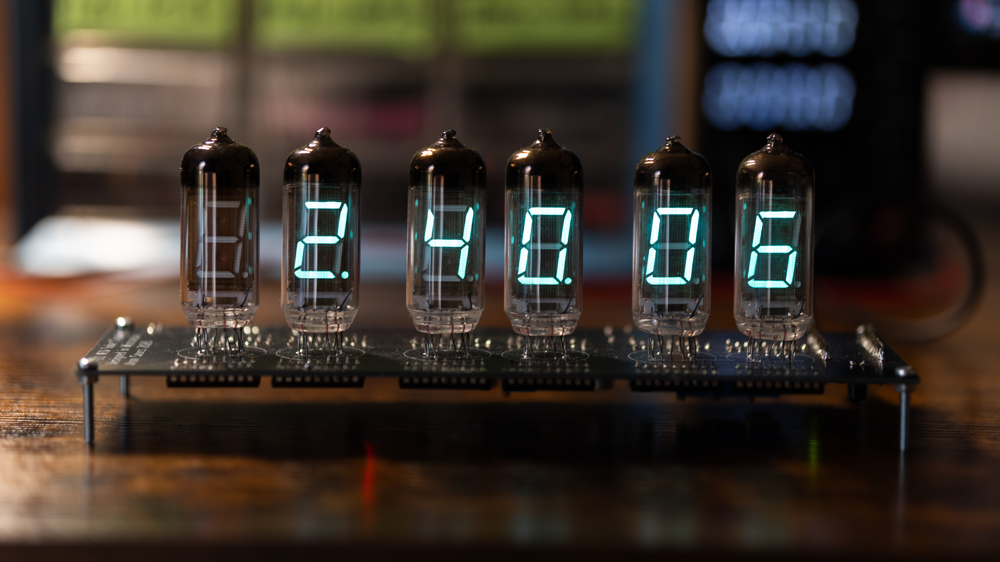
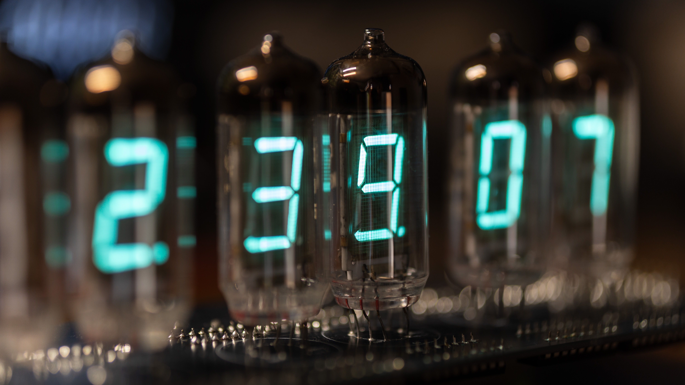
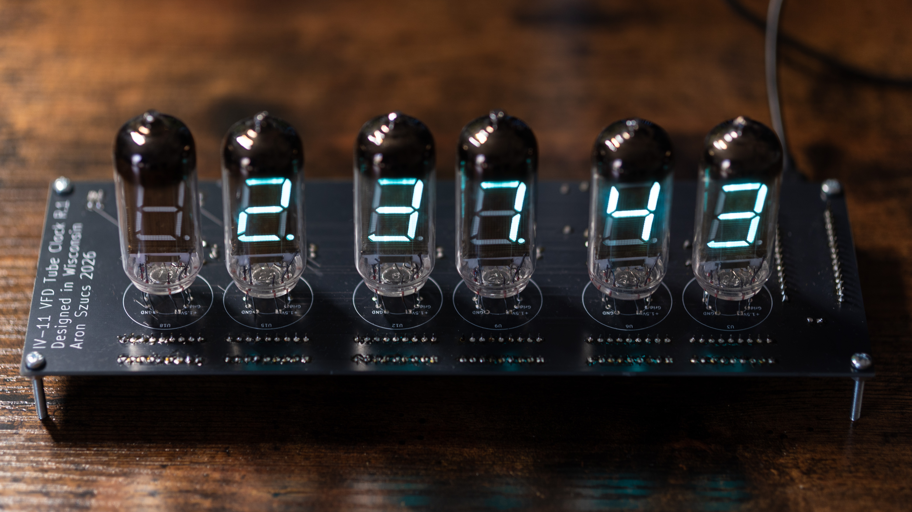
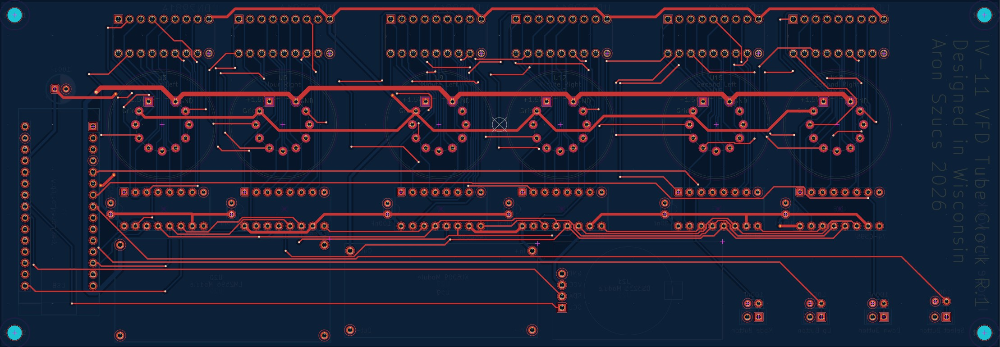
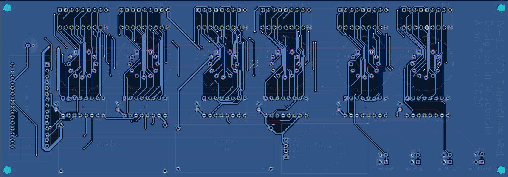
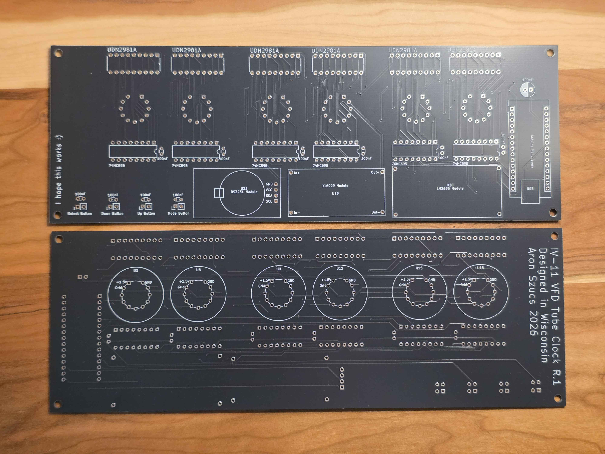
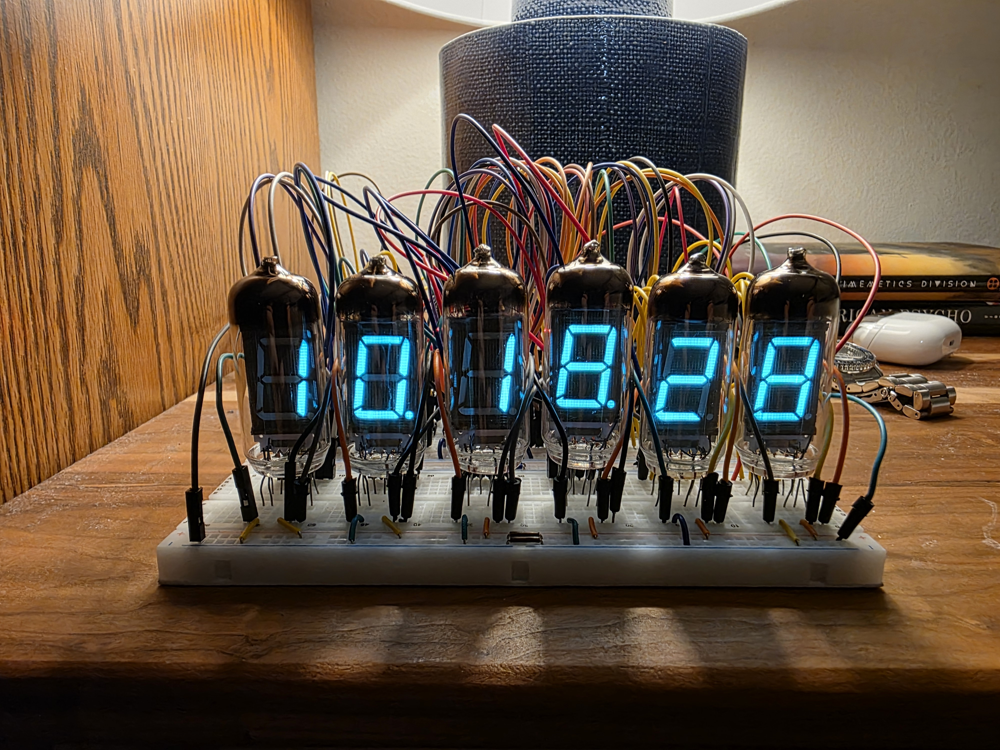
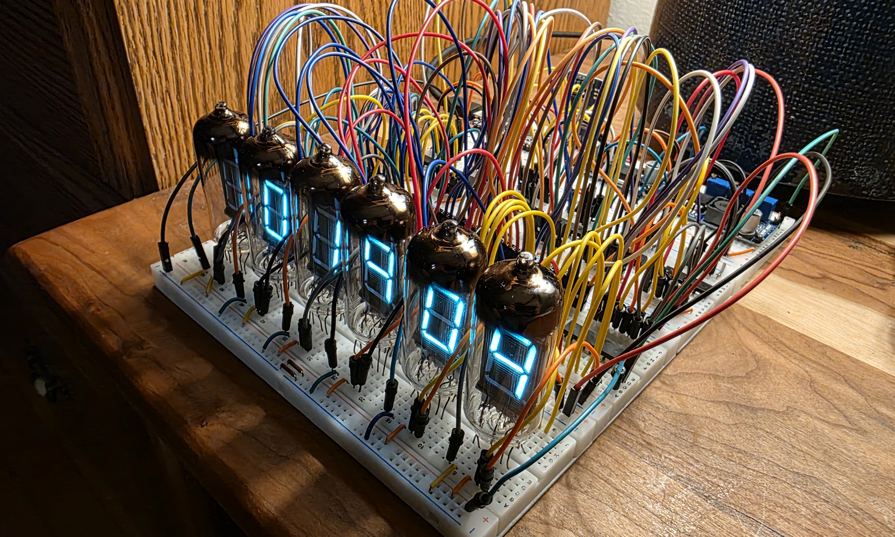

<h1 align="center">IV-11 VFD Tube Clock</h1>

  

  
  

---

## Overview

A 6-digit clock built around Soviet-era IV-11 vacuum fluorescent display tubes, vintage components manufactured in Ukraine during the 1970s-80s. The entire project was designed from scratch, including schematic design, custom PCB layout, and firmware, with no kit or reference design used beyond architectural inspiration.

---

## Hardware

**Display**
6x IV-11 7-segment VFD tubes driven in a static configuration. One dedicated 74HC595N shift register and UDN2981A high-voltage source driver per tube, all daisy-chained via SPI. Static drive means every tube is on simultaneously at full brightness with no multiplexing.

**Power Supply**
The clock runs entirely from a 5V USB source with two onboard switching converters:
- XL6009 boost converter stepping 5V → 25V for the anode and grid rails
- LM2596 buck converter stepping 5V → 1.5V for the tube filament rails

**Timekeeping**
DS3231 real-time clock module over I2C with CR2032 battery backup. Accurate to ±2ppm and loses less than one minute per year.

**Microcontroller**
Arduino Nano Every handling SPI display control, I2C RTC communication, PWM brightness via shift register OE pin, button input with hardware debounce, and EEPROM-persistent user settings.

---

## Firmware

The clock firmware implements a 7-state FSM for all user interaction:

| Mode | Function |
|---|---|
| 0 | Normal clock display |
| 1 | Set hours |
| 2 | Set minutes |
| 3 | Set seconds |
| 4 | Manual brightness (1–9) |
| 5 | Auto-brightness on/off |
| 6 | 12/24hr toggle |

Features include PWM brightness control via the 74HC595 OE pin, automatic-brightness scheduling by hour of day, hardware debounce capacitors on all button inputs, and full EEPROM persistence for brightness, auto-brightness, and 12/24hr preference across power cycles.

---

## PCB

2-layer board designed in KiCad, fabricated by JLCPCB. Custom symbols and footprints created for the IV-11 tubes, XL6009 boost converter, and LM2596 buck converter modules. Ground plane on the bottom copper layer. Power traces sized for current capacity: 1.0mm for the 600mA filament rail and 0.5mm for the 25V anode rail.

  
  

  

---

## Design Decisions
- I chose a static drive architecture over multiplexing for driving the VFD tubes to prioritize maximum tube brightness. Multiplexing would have reduced the total IC count substantially, but static drive increases perceived brightness and simplifies the firmware significantly.
- I used standalone pre-made buck and boost converter modules rather than integrating discrete switching converter circuits directly into the PCB to reduce design complexity on a first revision. These modules are cheap and if one fails in the future it can be swapped out easily.
- Instead of an ESP32 I used an Arduino Nano Every because this project does not require Bluetooth or WiFi. It is a simple clock after all. This did mean manual time-setting functionality needed to be implemented, which I handled by designing a 7-state FSM with full time adjustment settings. The ESP32 also runs at 3.3V which would have introduced an additional voltage level to manage.
- I encountered button signal bouncing during breadboard prototyping, so I added hardware debouncing via 100nF capacitors on each button GPIO pin in addition to software debouncing. The combination made false presses essentially nonexistent.
- I really wanted to add brightness control to my clock so it's not extremely bright at night, so I came up with the idea of toggling the output enable signal of the shift registers from a variable PWM from the Arduino Nano Every. The end result is a clean, software-driven brightness control.
- To improve signal integrity and simplify routing, I poured a solid ground plane across the entire bottom copper layer of the PCB rather than routing individual ground traces.

  
  

---

## Build Notes

- The IV-11 tubes arrived from Ukraine after ~5 weeks in transit
- A tube tester utility was written to map each shift register bit to its physical segment before finalizing the digit lookup table
- The tube footprint was initially mirrored due to a bottom-view vs top-view convention mismatch in an online reference — caught before ordering and corrected
- This is my first major PCB design and the first revision worked flawlessly
- Production-ready Gerber files are included in the `Gerbers` folder. 

---

## Cost

| Component | Source | Cost |
|---|---|---|
| IV-11 tubes × 6 | eBay | $40.09 |
| PCB × 5 | JLCPCB | $22.84 |
| Buttons × 6 | AliExpress | $6.93 |
| Screws and hex nuts | Hardware Store | $6.25 |
| UDN2981A × 10 | AliExpress | $3.39 |
| XL6009 modules × 3 | AliExpress | $2.99 |
| DS3231 RTC module | AliExpress | $2.19 |
| LM2596 modules × 2 | AliExpress | $1.59 |
| 74HC595N × 10 | AliExpress | $1.19 |
| Arduino Nano Every | University | Free |
| Capacitors, resistors, headers | University | Free |
| **Total** | | **$87.46** |

## Acknowledgements

*Inspired by [OpenVFD](https://www.instructables.com/OpenVFD-6-Digit-IV-11-VFD-Tube-Clock/) for the static drive architecture using 74HC595 shift registers and UDN2981A source drivers.*
